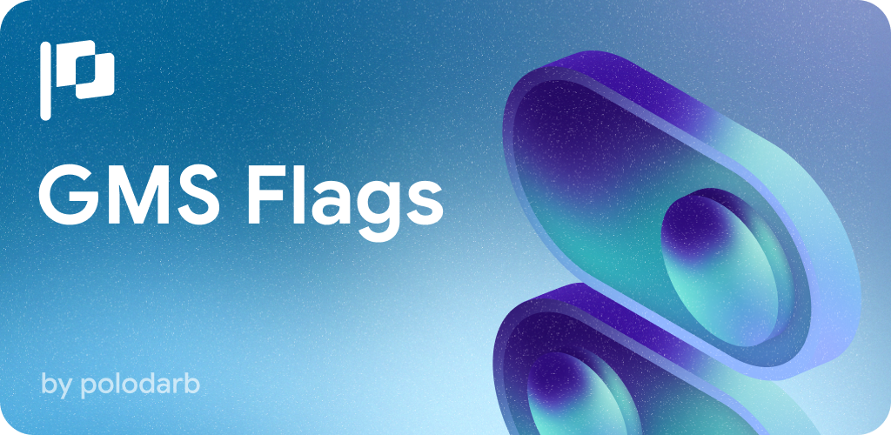

# GMS-Flags
 
 
 
[](https://t.me/gmsflags)




## Features:
- **Suggestions screen** - This is a screen that prompts the user to activate some interesting flags. The suggested flags allow the user to read some notes, open the application itself and its settings. It is possible to reset the flag value, see more detailed information or report some problem to the developer.
- **Apps screen** - This screen generates a list of applications and their associated list of packages with flags within them. This allows you to quickly and conveniently find the appropriate flag.
- **Saved screen** - Display lists of user-saved packages and flags.
- **Packages screen** - Display a list of all packages in alphabetical order that contain flags. There is a search and an option to save the package for quick access.
- **Flag Change screen** - The most important screen, which allows you to change the parameters of the flags. Flags are divided into 4 different types - Boolean/Int/Float/String. Screen functionality:
     - Ability to select some or all booleans flags and activate or deactivate them in one click.
     - Ability to save all selected flags in one click.
     - Ability to send a list of selected flags to another application.
     - Ability to suggest or report a problem about a flag or set of flags.
     - For Int/Float/String flags, it is possible to delete an overwritten value.
     - Filtering of flags by modified, activated and deactivated flags.
     - Ability to add a flag manually.
     - Ability to delete all flags changes, e.g. if it caused any problems.
- **Add Multiple Flags screen** - Ability to record a large set of flags of all available types at once.
- **Settings screen** - Settings allow you to delete ALL overwritten flags and saved flags/packages. It is also possible to assign a start screen when launching the application and the ability to view more detailed information about the GMS Flags.

## Note
> [!IMPORTANT]
> It usually takes 1 to 3 force-stops for a flag to be applied. If the flag still does not apply, you should wait 24 hours or reset the application data. 

# Download
[](https://github.com/polodarb/GMS-Flags/releases/download/1.1.0/gms_flags_1.1.0.apk)

## License

```MIT License

Copyright (c) 2023 Danyil Kobzar

Permission is hereby granted, free of charge, to any person obtaining a copy
of this software and associated documentation files (the "Software"), to deal
in the Software without restriction, including without limitation the rights
to use, copy, modify, merge, publish, distribute, sublicense, and/or sell
copies of the Software, and to permit persons to whom the Software is
furnished to do so, subject to the following conditions:

The above copyright notice and this permission notice shall be included in all
copies or substantial portions of the Software.

THE SOFTWARE IS PROVIDED "AS IS", WITHOUT WARRANTY OF ANY KIND, EXPRESS OR
IMPLIED, INCLUDING BUT NOT LIMITED TO THE WARRANTIES OF MERCHANTABILITY,
FITNESS FOR A PARTICULAR PURPOSE AND NONINFRINGEMENT. IN NO EVENT SHALL THE
AUTHORS OR COPYRIGHT HOLDERS BE LIABLE FOR ANY CLAIM, DAMAGES OR OTHER
LIABILITY, WHETHER IN AN ACTION OF CONTRACT, TORT OR OTHERWISE, ARISING FROM,
OUT OF OR IN CONNECTION WITH THE SOFTWARE OR THE USE OR OTHER DEALINGS IN THE
SOFTWARE.
